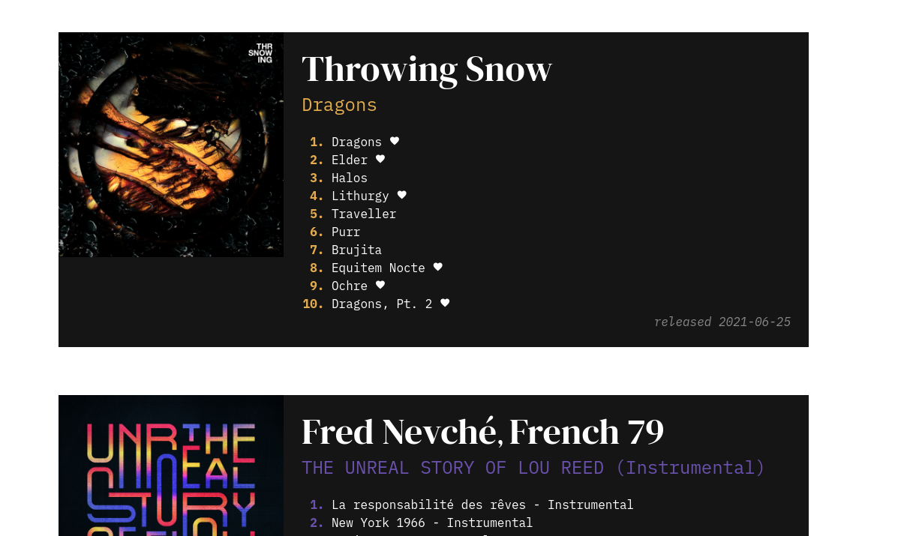
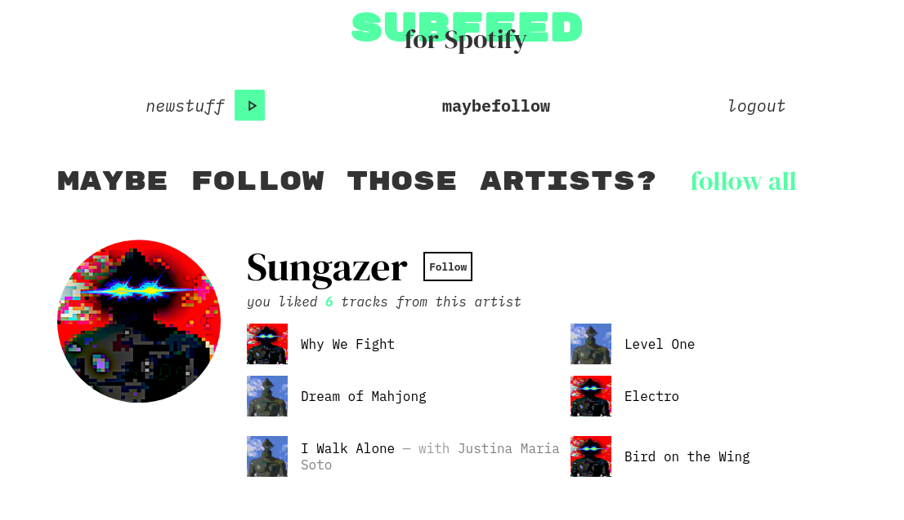
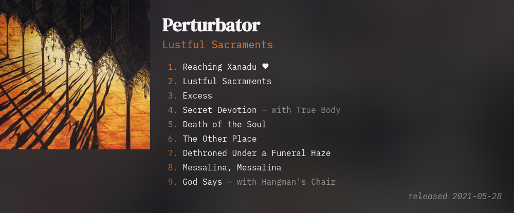

# subfeed for Spotify

:: fr

La seule chose se rapprochant le plus d'un fil d'abonnement sur Spotify est la playlist “Releases Radar”, qui, au lieu de simplement afficher les dernières sorties des artistes suivis, utilise une boîte noire algorithmique pour les mélanger à d'autres morceaux susceptibles de nous plaire.

Le problème est que certaines fois, on peut manquer un album: Spotify n'affiche qu'un morceau d'un album entier dans sa playlist. De plus, les morceaux ne sont pas triés par ordre chronologique descendant de date de sortie, ce qui paraît pourtant intuitif.

Souhaitant quelque chose de plus simple, j'ai décidé de travailler sur une petite application web permettant de voir clairement ce que mes artistes favoris viennent de sortir.

De plus, un onglet _“maybefollow”_ (peut-être-suivre) suggère des artistes à suivre. L'algorithme de suggestion est clair et simple: les artistes que vous ne suivez pas mais dont vous avez aimé au moins cinq morceaux sont affichés ici.

L'application a été réalisé avec l'excellent nouveau _framework_ web _Svelte_, et a d'abord été prototypé dans une alternative Open Source à Figma, _Penpot_.

[Code source](https://github.com/ewen-lbh/subfeed-for-spotify)

[Application](https://subfeed-for-spotify.surge.sh)

[Prototype](https://design.penpot.app/#/view/6aa120d0-c0aa-11eb-b700-c13c371b4289/6aa120d1-c0aa-11eb-b700-c13c371b4289?token=Wklpv2aawSCLjkLS6zo3Mw&index=0)

:: en

The closest thing Spotify has to a subscription feed is the "Releases Radar" playlist, which, instead of simply displaying the latest releases of the artists it tracks, uses an algorithmic black box to mix them with other songs we might like.

The problem is that sometimes you can miss an album: Spotify only displays one track from an entire album in its playlist. Moreover, the tracks are not sorted in chronological order by release date, which seems intuitive.

Wanting something simpler, I decided to work on a small web application allowing me to get the full picture of what my favorite artists have just released.

Moreover, a "maybefollow" tab suggests artists to follow. The suggestion algorithm is clear and simple: when you liked at least 5 tracks from a not-followed artist, it appears here.

The application was made with the excellent new web framework _Svelte_, and was first prototyped in an open source alternative to Figma, _Penpot_.

[Source code](https://github.com/ewen-lbh/subfeed-for-spotify)

[Application](https://subfeed-for-spotify.surge.sh)

[UI Prototype](https://design.penpot.app/#/view/6aa120d0-c0aa-11eb-b700-c13c371b4289/6aa120d1-c0aa-11eb-b700-c13c371b4289?token=Wklpv2aawSCLjkLS6zo3Mw&index=0)
